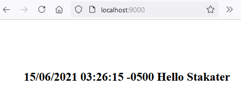

# Stakater Frontend!

This project was generated with [Angular CLI](https://github.com/angular/angular-cli) version 11.0.1.

# Development server

Run `ng serve` for a dev server. Navigate to `http://localhost:4200/`. The app will automatically reload if you change any of the source files.

# Dockerfile

Everything related to the images and containers was created using Docker Desktop Version 3.3.3 (64133) on Windows. The following are the commands for building the image and run a container.
```
docker build -t luisjavierjn/stakater-angular-app:1.0 .
docker run --rm -p 9000:4000 luisjavierjn/stakater-angular-app:1.0
```
As you might notice to run the container the port is mapped from 4000 to 9000 which is the one allowed by the Backend to accept requests from the Frontend. The image was uploaded to the following repository:

https://hub.docker.com/repository/docker/luisjavierjn/stakater-angular-app



The Dockerfile was created to consider **Server-side rendering (SSR) with Angular Universal**. "A normal Angular application executes in the browser, rendering pages in the DOM in response to user actions. Angular Universal executes on the server, generating static application pages that later get bootstrapped on the client. This means that the application generally renders more quickly, giving users a chance to view the application layout before it becomes fully interactive." https://angular.io/guide/universal

The advantage of this approach is that we are able to get the content of the webpage, for example, making a call with CURL as it is shown in the following image:


# Kubernetes

The folder Kubernetes contains the yaml file auto-generated when a resource is created through the Kubernetes dashboard out of the image previously loaded in docker**hub**. Docker Desktop brings Kubernetes v1.19.7 as a single-node cluster, it is part of the options that can be enabled to start off along with Docker. The following commands enable the usage of the dashboard for the Kubernetes cluster coming from Docker Desktop, set an **Skip** button to the initial screen for fast entry and trigger the dashboard.
```
kubectl apply -f https://raw.githubusercontent.com/kubernetes/dashboard/v2.2.0/aio/deploy/recommended.yaml
kubectl patch deployment kubernetes-dashboard -n kubernetes-dashboard --type 'json' -p '[{"op": "add", "path": "/spec/template/spec/containers/0/args/-", "value": "--enable-skip-login"}]'
kubectl proxy
```
